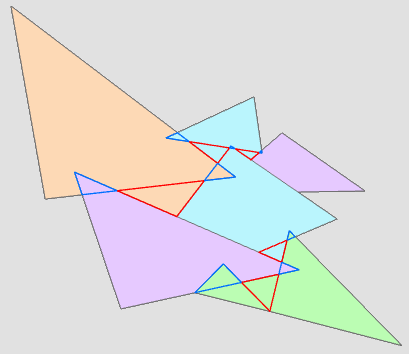

# topology-repair
Topology repair tool for ESRI ArcGIS Pro

Tested with Arc Pro 2.0 and 2.4

Hand drawn datasets can have hundreds of tiny overlap and gap errors between polygons — a real pain to correct manually one by one with ESRI's topology tools. This script automatically corrects overlap and gap errors, picking the longest common edge that the error polygon has with a neighboring feature polygon and giving that neighbor's attribute value to the error polygon.

To run:

topology_repair(inFile=path_to_shapefile, dissolve_field=shapefile_attribute_field, gap_threshold=max_gap_area)

  
Original data

  
Gap errors (red) and overlap errors (blue)  

  
Repaired topology
